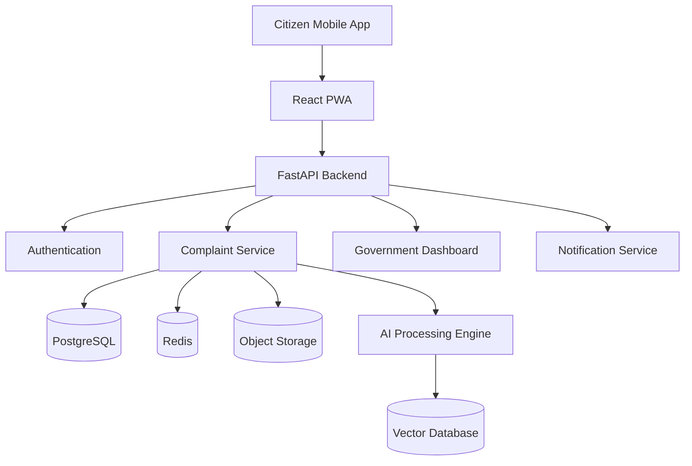
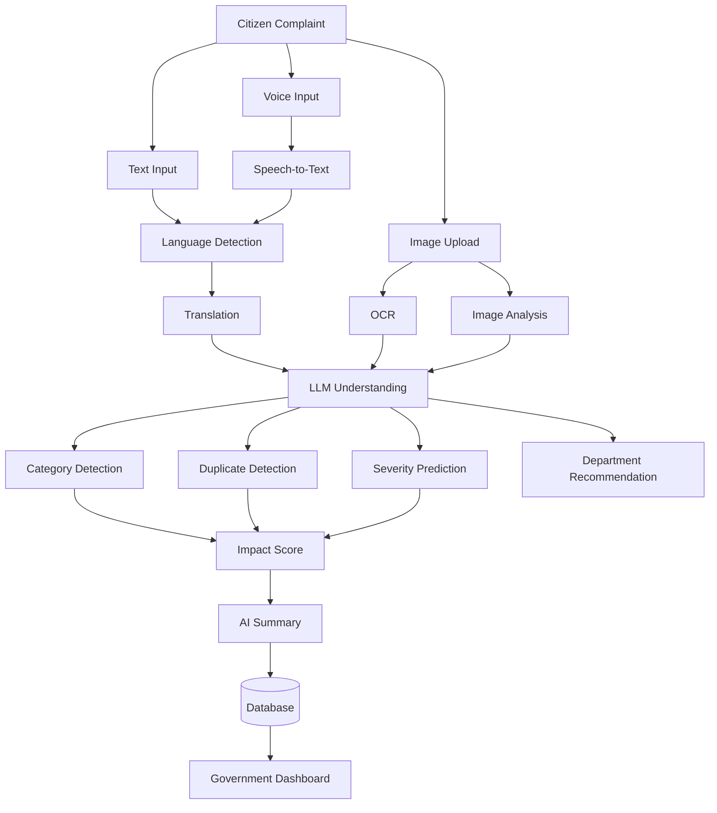
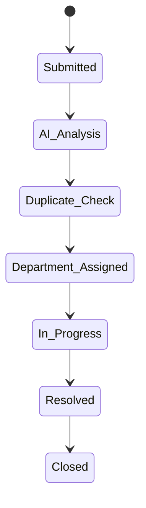
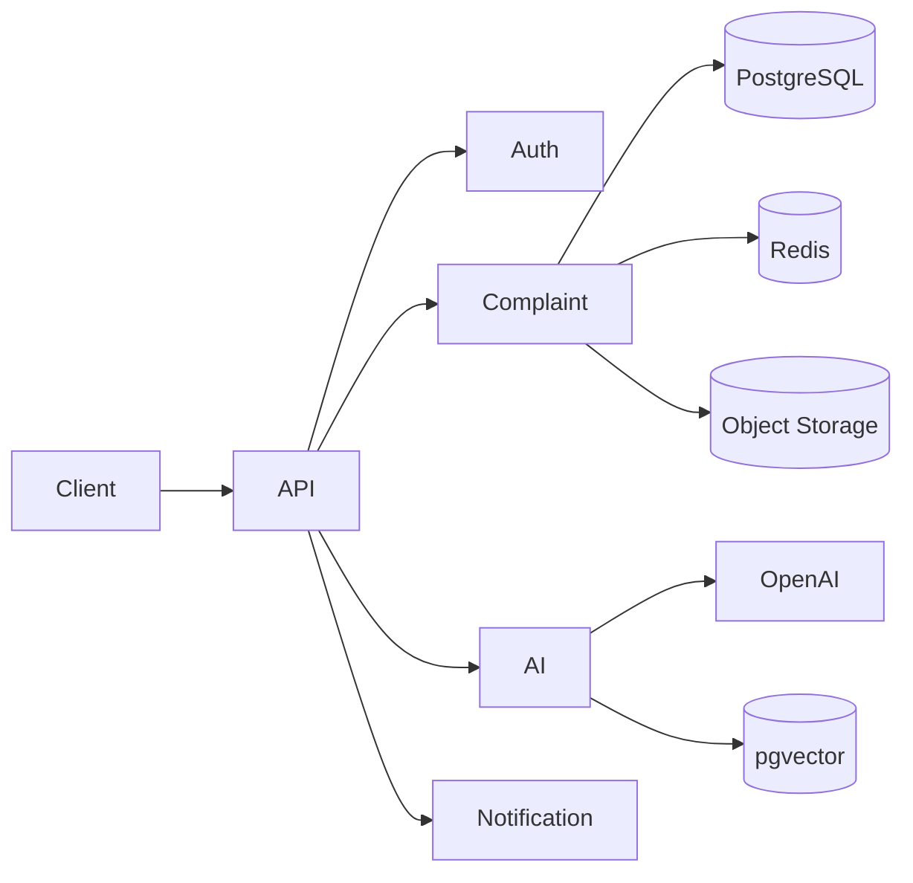
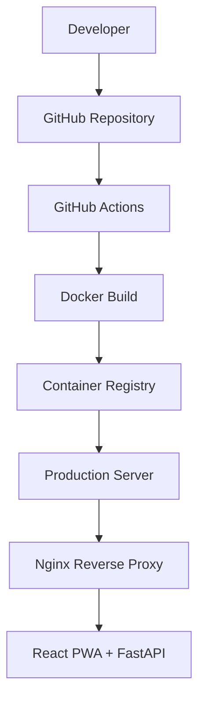

<div align="center">

#  Civic Connect AI

### AI-Powered Civic Governance Platform

*Turning citizen reports into actionable government intelligence.*

[](https://opensource.org/licenses/MIT)
[](#)
[](#)
[](#)
[](#)
[](#contributing)

[Overview](#overview) • [Features](#features) • [Tech Stack](#technology-stack) • [Architecture](#architecture) • [Getting Started](#getting-started) • [Roadmap](#future-enhancements)

</div>

---

## Overview

**Civic Connect AI** is an intelligent civic grievance management platform that helps citizens report public infrastructure issues in seconds — while giving **Members of Parliament (MPs), government officials, and municipal departments** the AI tooling to prioritize and resolve them faster.

The platform combines **image analysis, natural language processing, geospatial intelligence, and AI-powered summarization** to turn raw citizen complaints into structured, actionable government work items.

> **Report in under 30 seconds. Resolve with AI-driven priority.**

The platform is built around three core principles:

| Principle | Description |
|---|---|
|  **Simple citizen experience** | Report an issue in under 30 seconds — photo, voice, or text |
|  **AI-assisted governance** | Automated summaries, severity scoring, and department routing |
|  **Faster issue resolution** | Duplicate detection and impact scoring cut through the noise |

AI Image Validation in Action

Every photo submitted by a citizen is automatically screened by the AI pipeline before it reaches a government official — filtering out irrelevant, blurry, or spam uploads.

<table>
  <tr>
    <th align="center">✅ Validation Passed</th>
    <th align="center">❌ Validation Failed</th>
  </tr>
  <tr>
    <td align="center"></td>
    <td align="center"></td>
  </tr>
</table>

---

## Features

###  Citizen Portal
- OTP Authentication
- Photo Upload
- Voice or Text Complaint
- Automatic GPS Location
- AI Complaint Summary
- Duplicate Complaint Detection
- Join Existing Complaint
- Complaint Tracking
- Multilingual Support
- Progressive Web Application (PWA)

###  Government Dashboard
- AI Prioritized Complaints
- Constituency Heatmaps
- Ward Analytics
- Department Assignment
- Complaint Lifecycle Management
- Resolution Tracking
- Notification System
- Performance Dashboard

###  Artificial Intelligence
- Complaint Summarization
- Image Analysis & OCR
- Speech-to-Text
- Language Translation
- Duplicate Detection
- Category Classification
- Severity Analysis
- Department Recommendation
- Impact Score Calculation

---

## Technology Stack

| Layer | Technology |
|---|---|
| **Frontend** | React, TypeScript, Vite |
| **Styling** | Tailwind CSS, shadcn/ui |
| **Backend** | FastAPI |
| **Authentication** | JWT, OTP |
| **Database** | PostgreSQL |
| **Cache** | Redis |
| **Vector Search** | pgvector |
| **Object Storage** | AWS S3 |
| **Maps** | Leaflet |
| **AI** | OpenAI APIs |
| **Deployment** | Docker, Nginx, GitHub Actions |

---

## Architecture

### High-Level System Architecture



### AI Processing Pipeline



### Complaint Lifecycle



### Backend Architecture



### AI Modules

- Complaint Understanding
- Vision Analysis
- OCR Processing
- Speech Recognition
- Language Translation
- Duplicate Detection
- Semantic Search
- Severity Estimation
- Department Prediction
- Impact Scoring
- AI Summarization

---

## Project Structure

```
civic-connect-ai/
├── frontend/
│   ├── src/
│   ├── components/
│   ├── pages/
│   ├── hooks/
│   └── services/
│
├── backend/
│   ├── api/
│   ├── ai/
│   ├── database/
│   ├── models/
│   ├── routes/
│   └── services/
│
├── infrastructure/
│   ├── docker/
│   ├── nginx/
│   ├── github-actions/
│   └── deployment/
│
├── docs/
├── assets/
└── README.md
```

---

## Security

-  JWT Authentication
-  Role-Based Access Control (RBAC)
-  HTTPS Everywhere
-  Input Validation
-  Rate Limiting
-  SQL Injection Protection
-  Cross-Site Scripting (XSS) Protection
-  Audit Logging
-  Secure Environment Variables

---

## Deployment



CI/CD is fully automated via **GitHub Actions**: every push builds a Docker image, publishes it to the container registry, and deploys behind an **Nginx** reverse proxy in front of the React PWA + FastAPI stack.

---

## Getting Started

> Add project-specific setup steps here once implementation begins — suggested outline below.

```bash
# Clone the repository
git clone https://github.com/<org>/civic-connect-ai.git
cd civic-connect-ai

# Backend setup
cd backend
pip install -r requirements.txt
uvicorn main:app --reload

# Frontend setup
cd ../frontend
npm install
npm run dev
```

---

## Future Enhancements

- [ ] Offline-first synchronization
- [ ] GIS ward visualization
- [ ] Predictive civic analytics
- [ ] AI resource estimation
- [ ] Department workload balancing
- [ ] Smart escalation engine
- [ ] Public transparency dashboard
- [ ] WhatsApp integration
- [ ] Government ERP integration

---

## Contributing

Contributions are welcome! Please open an issue before submitting major architectural or functional changes so we can discuss the approach.

1. Fork the repository
2. Create a feature branch (`git checkout -b feature/your-feature`)
3. Commit your changes
4. Open a pull request

---

## License

This project is licensed under the **MIT License**.

<div align="center">

Made with ⚡ for smarter, faster civic governance.

</div>
